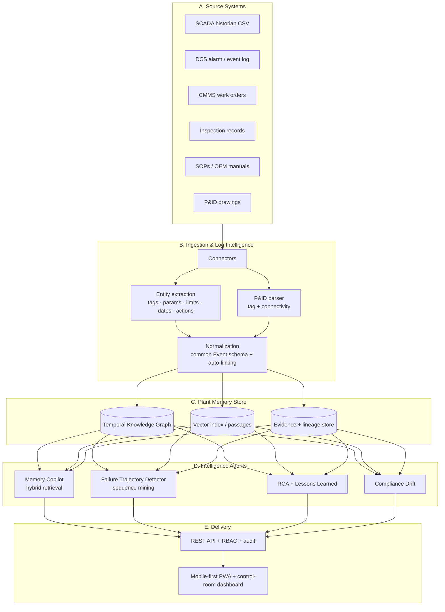

# CHRONOS — Unread Plant Memory Engine (UPME)

> **Turn decades of ignored plant data into predictive operational intelligence.**

CHRONOS converts the fragmented, unread operational traces of an industrial
plant — SCADA historian, DCS alarm logs, CMMS work orders, inspection records,
SOPs, OEM manuals and P&IDs — into a **queryable, causal, continuously-learning
operational memory**.

Unlike a standard RAG copilot, CHRONOS builds a **Temporal Industrial Knowledge
Graph + Sequence Intelligence layer**. It doesn't just answer *"what does the
manual say?"* — it answers:

> **"What happened here before, what pattern are we entering now, and what action prevents repeat loss?"**

It is **zero-dependency** (Python standard library only) and runs fully offline
— ideal for an air-gapped plant. One command builds a realistic synthetic plant;
one command serves the app.

---

## Quick start

```bash
# 1. Build the plant memory (generate data -> graph -> indexes)
python -m chronos.pipeline --reset

# 2. Run the app  (open http://127.0.0.1:8000)
python -m chronos.server
```

Or use the helper scripts: `./run.sh` (macOS/Linux) or `./run.ps1` (Windows).

Other entry points:

```bash
python -m chronos.demo             # full engine walkthrough in the console
python -m chronos.eval.benchmark   # quantified benchmark table
```

Requires **Python 3.10+**. No external packages are needed to run.

---

## What makes it different

| Capability | Standard RAG copilot | CHRONOS |
|---|---|---|
| Answer from documents | ✅ | ✅ |
| **Temporal knowledge graph** (asset–event–doc–person–action, time-valid) | ❌ | ✅ |
| **Failure-trajectory mining** (recurring pre-failure sequences) | ❌ | ✅ |
| **Lead-time-to-failure** estimate with confidence | ❌ | ✅ |
| **Decision replay** ("when did we see this, what was done, outcome?") | ❌ | ✅ |
| **Evidence-backed RCA** + auto lessons-learned playbook | ❌ | ✅ |
| **Compliance gap detection** + audit-ready evidence packs | ❌ | ✅ |
| **P&ID tag + connectivity extraction** | ❌ | ✅ |
| **Confidence score + citations on every answer** | partial | ✅ |
| Runs **fully offline / on-prem** | varies | ✅ |

---

## Architecture



### Layers
- **A. Connectors** read each source in its *native* shape (different tag
  columns, date formats, status vocabularies) — the real-world identity problem.
- **B. Ingestion** does entity extraction, P&ID parsing, and normalizes
  everything onto one **Event schema** with cross-system auto-linking + lineage.
- **C. Store** is a SQLite property graph with time-valid nodes/edges, a passage
  index for semantic retrieval, and an evidence store for citations.
- **D. Intelligence** are the four agents below.
- **E. Delivery** is a zero-dependency HTTP API (RBAC + audit) and a mobile-first
  web app.

---

## Functional modules

| # | Module | Where |
|---|---|---|
| 1 | Unified ingestion & auto-linking | [`ingest/normalize.py`](chronos/ingest/normalize.py) |
| 2 | Plant memory graph | [`store/schema.sql`](chronos/store/schema.sql), [`intel/graph.py`](chronos/intel/graph.py) |
| 3 | **Sequence-to-risk intelligence** (differentiator) | [`intel/sequence.py`](chronos/intel/sequence.py) |
| 4 | Decision replay & action guidance (copilot) | [`intel/copilot.py`](chronos/intel/copilot.py) |
| 5 | RCA + lessons-learned automation | [`intel/rca.py`](chronos/intel/rca.py) |
| 6 | Compliance & quality intelligence | [`intel/compliance.py`](chronos/intel/compliance.py) |
| + | P&ID parsing | [`ingest/pid.py`](chronos/ingest/pid.py) |
| + | Security: RBAC + audit | [`security.py`](chronos/security.py) |
| + | Evaluation harness | [`eval/benchmark.py`](chronos/eval/benchmark.py) |

---

## Data model

**Nodes:** Asset · Event (alarm/trip/reading/work-order/inspection/bypass) ·
Document · Clause · Person · (Action & Outcome captured as event subtypes).

**Relationships** (all carry `valid_from`, `valid_to`, `confidence`):
`ASSET_HAS_EVENT`, `EVENT_INVOLVES_PERSON`, `EVENT_MENTIONS_ASSET`
(cross-system auto-link), `DOC_GOVERNS_ASSET`, `DOC_SUPERSEDES_DOC`,
`CLAUSE_APPLIES_TO_ASSET`, `PID_SHOWS_ASSET`, `CONNECTED_TO` (P&ID connectivity).

---

## Security & deployment

- **RBAC**: tokens → roles (`technician`, `engineer`, `compliance`, `admin`) →
  scopes. Every API route is authorised against the role; denied calls are
  blocked and logged. Switch role from the top-right selector to see it live.
- **Audit trail**: append-only `var/audit.log` of every API call (role, route,
  status). Readable by `admin` via `/api/audit`.
- **On-prem / air-gapped**: no external services, no telemetry, no model
  downloads. The whole system is one Python process + a SQLite file.

| Demo token | Role | Can |
|---|---|---|
| `eng-demo` | engineer | everything except audit |
| `tech-demo` | technician | read, copilot, RCA |
| `comp-demo` | compliance | read, copilot, compliance |
| `admin-demo` | admin | everything incl. audit |

---

## Benchmarks (`python -m chronos.eval.benchmark`)

Measured on the bundled synthetic plant:

| Metric | Result |
|---|---|
| Entity extraction P / R / F1 | 1.00 / 0.94 / **0.97** |
| P&ID tag extraction F1 | **1.00** |
| P&ID connectivity F1 | **1.00** |
| Failure-trajectory prediction P / R / F1 | 1.00 / 1.00 / **1.00** |
| Citation rate (answers source-backed) | **100%** |
| Event→asset graph linkage | **100%** |
| Source systems unified | **4** (+ P&ID) |
| Time-to-information | 1 ranked, cited answer vs ~90 raw matches to read manually |

> The sequence numbers are reported on the bundled scenario; the harness is the
> hook for cross-validated evaluation on real historian data.

---

## Tests

```bash
python tests/test_engine.py        # no pytest needed
# or:  python -m pytest -q
```

---

## About the data (important, and honest)

Real SCADA/CMMS data is proprietary and cannot ship in a public repo. CHRONOS
therefore **generates a realistic synthetic plant** ([`datagen/generator.py`](chronos/datagen/generator.py))
that mirrors genuine source-system exports **and embeds the recurring failure
trajectories** the engine is meant to discover:

```
seal replacement → alignment marginal → vibration rise → alarm chatter
→ temporary trip-interlock bypass → deferred work order → TRIP
```

Three historical pump failures share this signature; a fourth, live, in-progress
case on **P-204** stops *before* the trip — so the detector has to catch it early.
The generator is deterministic (fixed seed), so every run is reproducible.

---

## Production swap-ins

The prototype is intentionally dependency-free; each component has a documented
production upgrade with an identical interface:

| Prototype (stdlib) | Production |
|---|---|
| SQLite property graph | Neo4j (temporal) |
| Pure-Python TF-IDF ([`vectorstore.py`](chronos/intel/vectorstore.py)) | pgvector / Weaviate + sentence-transformer embeddings |
| Regex/rule NER ([`extract.py`](chronos/ingest/extract.py)) | fine-tuned transformer NER |
| Geometric P&ID parser | Azure Document Intelligence / LayoutParser |
| stdlib HTTP server | FastAPI + uvicorn behind the plant IdP |
| Demo tokens | LDAP / SAML SSO + tamper-evident audit |

---

## Repository layout

```
chronos/
  config.py            paths, deterministic seed, tuning
  datagen/generator.py synthetic plant with embedded failure trajectories
  store/               SQLite temporal knowledge graph (schema + helpers)
  ingest/              connectors · entity extraction · P&ID parser · normalization
  intel/               vectorstore · graph · copilot · sequence · rca · compliance
  eval/benchmark.py    evaluation harness
  security.py          RBAC + audit
  pipeline.py          build orchestrator
  server.py            REST API + static server
  demo.py              console walkthrough
data/                  authored corpus (SOPs, OEM manual, regulations, P&ID)
frontend/              mobile-first PWA (index.html, styles.css, app.js)
tests/                 engine tests
var/                   generated artefacts + DB (git-ignored)
```

---
UnderProcess
