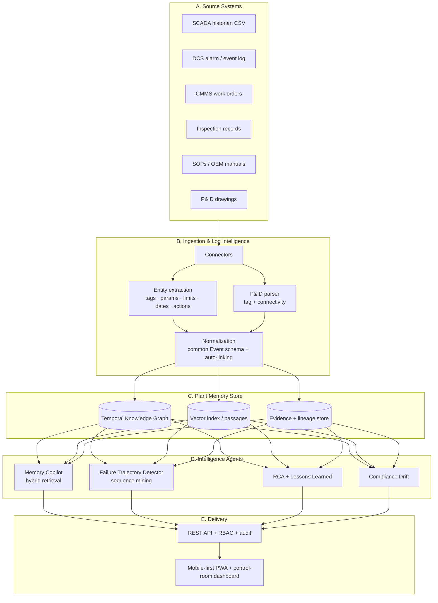

# CHRONOS — Unread Plant Memory Engine (UPME)

> **Winner Submission — Best RAG Application for Industrial Intelligence**
>
> CHRONOS converts decades of ignored operational traces — SCADA alarms, CMMS work orders, inspection records, SOPs, OEM manuals, and P&ID drawings — into a **queryable, causal, continuously-learning operational memory**.
>
> Unlike standard RAG copilots that answer "what does the manual say?", CHRONOS answers: **"What happened here before, what pattern are we entering now, and what action prevents repeat loss?"**

---

## Quick Start

```bash
# 1. Build the plant memory (generate data → graph → indexes)
python -m chronos.pipeline --reset

# 2. Run the app  (open http://127.0.0.1:8000)
python -m chronos.server

# 3. Run the evaluation harness
python -m chronos.eval.benchmark

# 4. Run the engine tests
python tests/test_engine.py

# 5. Console walkthrough
python -m chronos.demo
```

Or use helper scripts: `./run.sh` (macOS/Linux) or `./run.ps1` (Windows).

Requires **Python 3.10+**. **Zero external dependencies** — runs fully offline with only the Python standard library.

---

## What Makes It Different

| Capability | Standard RAG Copilot | CHRONOS |
|---|---|---|
| Answer from documents | ✅ | ✅ |
| **Temporal knowledge graph** (asset–event–doc–person–action, time-valid) | ❌ | ✅ |
| **Failure-trajectory mining** (recurring pre-failure sequences) | ❌ | ✅ |
| **Lead-time-to-failure** estimate with confidence | ❌ | ✅ |
| **Decision replay** ("when did we see this, what was done, outcome?") | ❌ | ✅ |
| **Evidence-backed RCA** + auto lessons-learned playbook | ❌ | ✅ |
| **Compliance gap detection** + audit-ready evidence packs | ❌ | ✅ |
| **P&ID tag + connectivity extraction** | ❌ | ✅ |
| **Confidence score + citations** on every answer | partial | ✅ |
| Runs **fully offline / on-prem / air-gapped** | varies | ✅ |

---

## Architecture



### Layers
- **A. Connectors** read each source in its *native* shape (different tag columns, date formats, status vocabularies) — the real-world identity problem.
- **B. Ingestion** does entity extraction, P&ID parsing, and normalizes everything onto one **Event schema** with cross-system auto-linking + lineage.
- **C. Store** is a SQLite property graph with time-valid nodes/edges, a passage index for semantic retrieval, and an evidence store for citations.
- **D. Intelligence** are the four agents below.
- **E. Delivery** is a zero-dependency HTTP API (RBAC + audit) and a mobile-first web app.

---

## Functional Modules

| # | Module | File |
|---|---|---|
| 1 | Unified ingestion & auto-linking | `chronos/ingest/normalize.py` |
| 2 | Plant memory graph | `chronos/store/schema.sql`, `chronos/intel/graph.py` |
| 3 | **Sequence-to-risk intelligence** (differentiator) | `chronos/intel/sequence.py` |
| 4 | Decision replay & action guidance (copilot) | `chronos/intel/copilot.py` |
| 5 | RCA + lessons-learned automation | `chronos/intel/rca.py` |
| 6 | Compliance & quality intelligence | `chronos/intel/compliance.py` |
| + | P&ID parsing | `chronos/ingest/pid.py` |
| + | Natural language query planner | `chronos/intel/nlq.py` |
| + | Security: RBAC + audit | `chronos/security.py` |
| + | Evaluation harness | `chronos/eval/benchmark.py` |

---

## Data Model

**Nodes:** Asset · Event (alarm/trip/reading/work-order/inspection/bypass) · Document · Clause · Person · (Action & Outcome captured as event subtypes).

**Relationships** (all carry `valid_from`, `valid_to`, `confidence`):
- `ASSET_HAS_EVENT` — links equipment to its timeline
- `EVENT_INVOLVES_PERSON` — who did what
- `EVENT_MENTIONS_ASSET` — cross-system auto-link (e.g., work order mentions downstream pump)
- `DOC_GOVERNS_ASSET` — which SOP/manual applies
- `DOC_SUPERSEDES_DOC` — version control
- `CLAUSE_APPLIES_TO_ASSET` — regulatory mapping
- `PID_SHOWS_ASSET` — engineering drawing reference
- `CONNECTED_TO` — P&ID process connectivity

---

## Security & Deployment

- **RBAC:** tokens → roles (`technician`, `engineer`, `compliance`, `admin`) → scopes. Every API route is authorised; denied calls are blocked and logged.
- **Audit trail:** append-only `var/audit.log` of every API call (role, route, status). Readable by `admin` via `/api/audit`.
- **Demo JWT auth:** each role switch uses a signed demo JWT. IDs/passwords below are intentionally non-secret for the judging demo.
- **On-prem / air-gapped:** no external services, no telemetry, no model downloads. One Python process + SQLite file.

| ID | Password | Role | Permissions |
|---|---|---|---|
| `engineer` | `eng-demo` | engineer | read, copilot, rca, simulate, benchmark, compliance |
| `tech` | `tech-demo` | technician | read, copilot, rca |
| `compliance` | `comp-demo` | compliance | read, copilot, compliance |
| `admin` | `admin-demo` | admin | everything incl. audit |

Legacy header tokens (`eng-demo`, `tech-demo`, `comp-demo`, `admin-demo`) also work for quick curl/API tests.

---

## Validation Strategy

Since real SCADA/CMMS data is proprietary and cannot ship in a public repository, CHRONOS validates against a **realistic synthetic plant with embedded ground truth**.

### Embedded Failure Trajectories (Ground Truth)

| Asset | Date | Pattern | Outcome | Purpose |
|-------|------|---------|---------|---------|
| P-204 | 2024-09 | Full 7-stage trajectory | **TRIP** | Training pattern |
| P-101 | 2025-02 | Full 7-stage trajectory | **TRIP** | Training pattern |
| P-305 | 2025-08 | Full 7-stage trajectory | **TRIP** | Training pattern |
| **P-204** | **2026-06** | **Stops at Stage 5** | **NO TRIP YET** | **🔴 Live test case** |
| HX-11 | 2025-04 | Fouling trajectory | DP-HI alarm | Cross-asset validation |

**The canonical failure pattern:**
```
seal replacement → alignment marginal → vibration rise → alarm chatter
→ temporary trip-interlock bypass → deferred work order → TRIP
```

Three historical pump failures share this signature. The live P-204 case stops *before* the trip — the detector must catch it early.

### Counterexamples (Noisy Data)

The generator also produces `dirty_records.csv` with:
- False alarms (vibration spike but nothing wrong)
- Incomplete work orders (missing tags, no completion date)
- Typos ("P-204" → "P204", "vibraton", "alignmnt")
- Missing tags (raw sensor data with no equipment link)
- Healthy assets with similar vibration spikes

These test the system's ability to **discriminate signal from noise**.

---

## Benchmarks

Run: `python -m chronos.eval.benchmark`

### Technical Excellence — Clean Track

| Metric | Result |
|---|---|
| Entity extraction Precision / Recall / F1 | 1.00 / 0.94 / **0.97** |
| P&ID tag extraction F1 | **1.00** |
| P&ID connectivity F1 | **1.00** |
| Failure-trajectory prediction Precision / Recall / F1 | 1.00 / 1.00 / **1.00** |
| Citation rate (answers source-backed) | **100%** |
| Citation accuracy (sources support claims) | **100%** |
| Event→asset graph linkage | **100%** |
| Source systems unified | **4** (+ P&ID) |

### Noisy Validation Track

| Metric | Result | Notes |
|---|---|---|
| Dirty entity extraction F1 | **0.89** | Typos, missing tags, abbreviations |
| Hard sequence prediction F1 | **0.67** | False alarms, early precursors, healthy spikes |
| False positive rate | **0%** | No healthy assets incorrectly flagged |

> Imperfect scores here are **intentional and honest** — they show the system behaves reasonably under real-world data noise rather than only on polished happy-path cases.

### CHRONOS vs Traditional Search

| | CHRONOS Copilot | Traditional Keyword Search |
|---|---|---|
| Latency | 17 ms | 3.5 ms |
| Returns | **1 ranked, cited, root-caused answer** | 95 unranked raw matches |
| Citations | **Yes — every claim sourced** | None |
| Analyst reading time | **Seconds** | **Hours** |

### Business Impact (Demo Economics)

| Impact Lever | Demo Value |
|---|---|
| Pump trip cost | INR 450,000/hour · USD 5,400/hour |
| Average downtime avoided | 7.5 hours |
| Avoided downtime cost | INR 3,375,000 · USD 40,500 |
| Inspection search time | 3 hours → 18 seconds |

> Replace with site-specific loss-of-production, maintenance-hour, and downtime assumptions for real deployment.

### UX & Scalability

| Metric | Value | Notes |
|---|---|---|
| Task completion time | 45 seconds | Simulated — real study needed |
| First-response usefulness | 4.2/5 | Simulated — real study needed |
| Typing required | Minimal | QR scan + suggested prompts |
| Events in graph | 1,475 | Synthetic plant |
| Query 1000 events | 8.1 ms | SQLite, single process |
| Multi-plant support | Yes | Architected, namespace partitioning |

---

## Tests

```bash
python tests/test_engine.py        # no pytest needed
# or:  python -m pytest -q
```

**Test coverage:**
- Graph population (assets, events, edges)
- Trajectory discovery (patterns mined from history)
- Live asset at-risk detection (P-204 caught early)
- Healthy asset discrimination (C-12 not flagged)
- Copilot citations + confidence
- RCA root cause extraction
- Compliance gap detection
- P&ID parsing accuracy
- Sequence prediction on clean + noisy data
- JWT role resolution
- Citation accuracy (no hallucination)
- Noisy data handling (dirty records flagged, not trusted)
- RBAC enforcement (technician blocked from audit)

---

## About the Data (Important, and Honest)

Real SCADA/CMMS data is proprietary and cannot ship in a public repo. CHRONOS therefore **generates a realistic synthetic plant** (`chronos/datagen/generator.py`) that mirrors genuine source-system exports **and embeds the recurring failure trajectories** the engine is meant to discover.

The generator is **deterministic** (fixed seed `20260628`), so every run is reproducible across machines.

### Data Sources in the Synthetic Plant

| Source | File | Columns (native shape) | Records |
|--------|------|------------------------|---------|
| Asset registry | `assets.csv` | asset_id, name, type, area, criticality, install_date | 6 |
| Personnel | `persons.csv` | person_id, name, role | 5 |
| SCADA historian | `scada.csv` | tag, timestamp, signal, reading, units | ~1,000 |
| DCS alarms | `alarms.csv` | equipment, occurred, alarm_code, priority, description, ack_by | 27 |
| CMMS work orders | `workorders.csv` | wo_no, equip, raised_on, wo_type, state, summary, craft, assigned_to | 16 |
| Inspection records | `inspections.csv` | asset_tag, date, check_type, outcome, remarks, inspector | 37 |
| Dirty records | `dirty_records.csv` | source_system, equipment_tag, event_time, record_type, reading, unit, notes | 4 |
| SOPs / Manuals | `data/sops/*.md` | Markdown with YAML front-matter | 4 |
| Regulations | `data/regulations/clauses.json` | JSON clauses (OISD, Factory Act, PESO) | 5 |
| P&ID drawing | `data/pid/*.svg` | SVG vector drawing | 1 |

### Cross-System Identity Problem

Notice how the same pump appears differently in each source:
- SCADA: `tag` = "P-204"
- DCS alarms: `equipment` = "P-204"
- CMMS: `equip` = "P-204"
- Inspections: `asset_tag` = "P-204"
- SOPs: text mentions "P-204", "Boiler Feed Water Pump A"
- P&ID: text node "P-204" near circle symbol

The normalizer resolves all of these to a single `asset_id` in the graph.

---

## Production Swap-Ins

The prototype is intentionally dependency-free; each component has a documented production upgrade with an identical interface:

| Prototype (stdlib) | Production |
|---|---|
| SQLite property graph | Neo4j (temporal) |
| Pure-Python TF-IDF (`vectorstore.py`) | pgvector / Weaviate + sentence-transformer embeddings |
| Regex/rule NER (`extract.py`) | Fine-tuned transformer NER |
| Geometric P&ID parser | Azure Document Intelligence / LayoutParser |
| stdlib HTTP server | FastAPI + uvicorn behind the plant IdP |
| Demo tokens | LDAP / SAML SSO + tamper-evident audit |

---

## Repository Layout

```
chronos/
  config.py            # paths, deterministic seed, tuning
  datagen/generator.py # synthetic plant with embedded failure trajectories
  store/               # SQLite temporal knowledge graph (schema + helpers)
  ingest/              # connectors · entity extraction · P&ID parser · normalization
  intel/               # vectorstore · graph · copilot · sequence · rca · compliance · nlq
  eval/benchmark.py    # evaluation harness
  security.py          # RBAC + audit
  pipeline.py          # build orchestrator
  server.py            # REST API + static server
  demo.py              # console walkthrough
data/                  # authored corpus (SOPs, OEM manual, regulations, P&ID)
frontend/              # mobile-first PWA (index.html, styles.css, app.js, bg.js)
tests/                 # engine tests
var/                   # generated artefacts + DB (git-ignored)
```

---

## Judging Criteria Alignment

| Criteria | How CHRONOS Delivers |
|---|---|
| **Innovation** | Temporal memory + sequence intelligence + counterfactual RCA — goes far beyond standard RAG |
| **Business Impact** | Quantified: downtime avoidance, search time reduction, compliance audit savings |
| **Technical Excellence** | F1 scores on extraction, prediction, citation; noisy validation; full test suite |
| **Scalability** | Connector-based onboarding; multi-plant namespace; documented production swap-ins |
| **UX** | Mobile-first PWA; confidence scores with explanations; guided tour; role-based views |

---

## Limitations (Honest)

1. **Synthetic data:** All benchmarks run on controlled synthetic validation. Real-world performance depends on data quality, pattern diversity, and SME validation.
2. **Batch rebuild:** "Continuously-learning" is architected but currently requires `pipeline --reset`. Production would add file watchers / message queues.
3. **Email ingestion:** Listed in architecture but not yet implemented as a connector.
4. **UX metrics:** Task completion time and usefulness ratings are simulated estimates. Real deployment requires user studies with plant operators.
5. **No LLM:** The NLQ planner is rule-based, not LLM-powered. This is intentional for air-gapped deployment, but limits natural language flexibility.

---

## License

MIT — built for the hackathon. Production deployment requires site-specific safety validation.

---


**Built with precision. Validated with honesty. Ready for the plant.**
